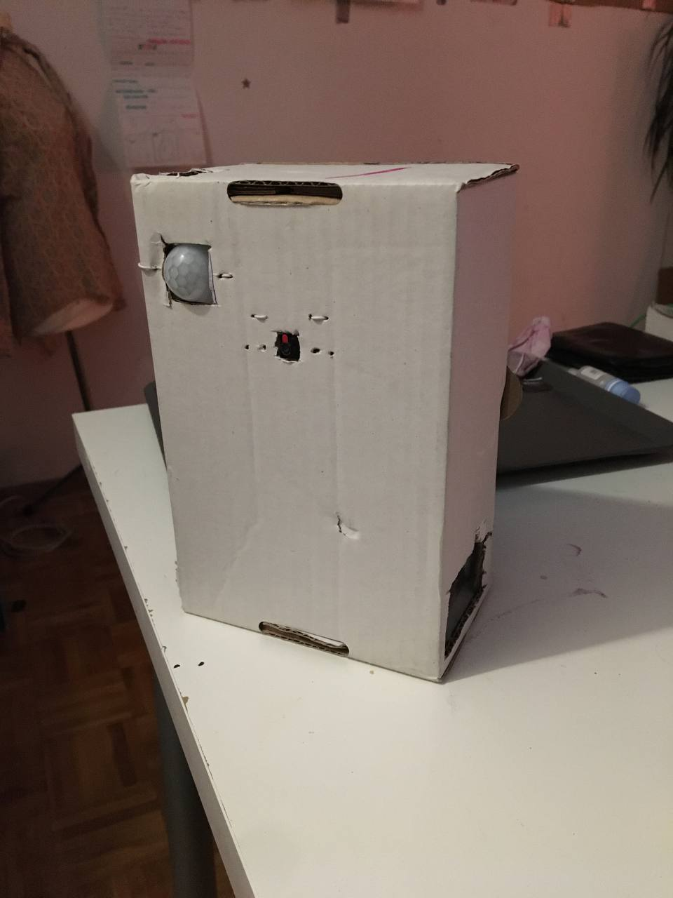
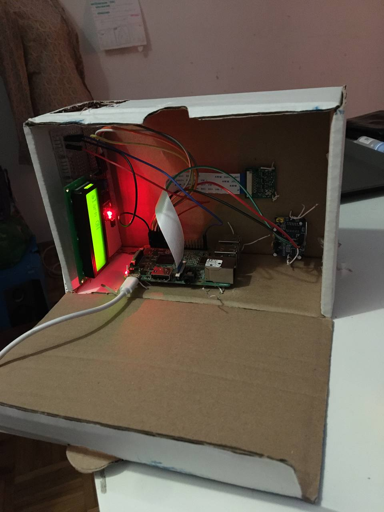

# Home security system with Raspberry Pi and sending photos on email.

Home security system with Raspberry Pi and sending notifications with a Telegram bot.

### How it works

- Alarm is set ON when pin 17 is on the HIGH stage, and OFF when is on LOW stage.
- After set alarm ON we have 10s to leve place.
- When a movement is detected, the application will take a photo and sent to your email.  
- To set alarm OFF we have to swich pin 17 from HIGH stage (+) in to LOW stage (-), simple as that.   

### Prerequisites.

* Raspberry Pi Camera Module  
* PIR motion sensor module   
* Multiple female-to-female and male-to-female jumper wires
* LCD 16x2 Display to see output   

## Built With
### Hardware:
* Raspberry Pi Zero WH
* Infrared Camera v2 8MP
* HC-SR501 PIR Motion Sensor Module
* LCD 2x16
* I2C

### Libraries:
* [gpiozero](https://pypi.org/project/gpiozero/)
* [python-telegram-bot](https://github.com/python-telegram-bot/python-telegram-bot)  
* [picamera](https://pypi.org/project/picamera/)
* [smtplib](https://docs.python.org/3/library/smtplib.html)
* [rpi_lcd](https://pypi.org/project/rpi-lcd/) 